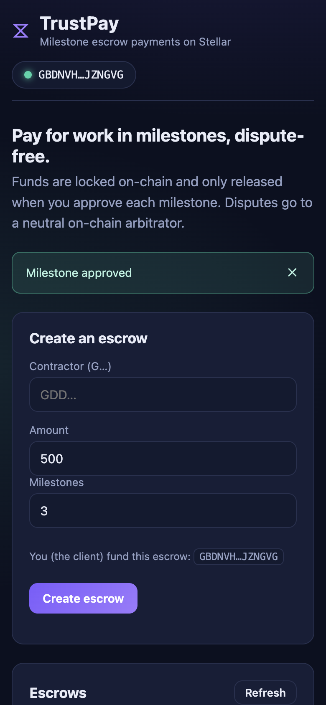
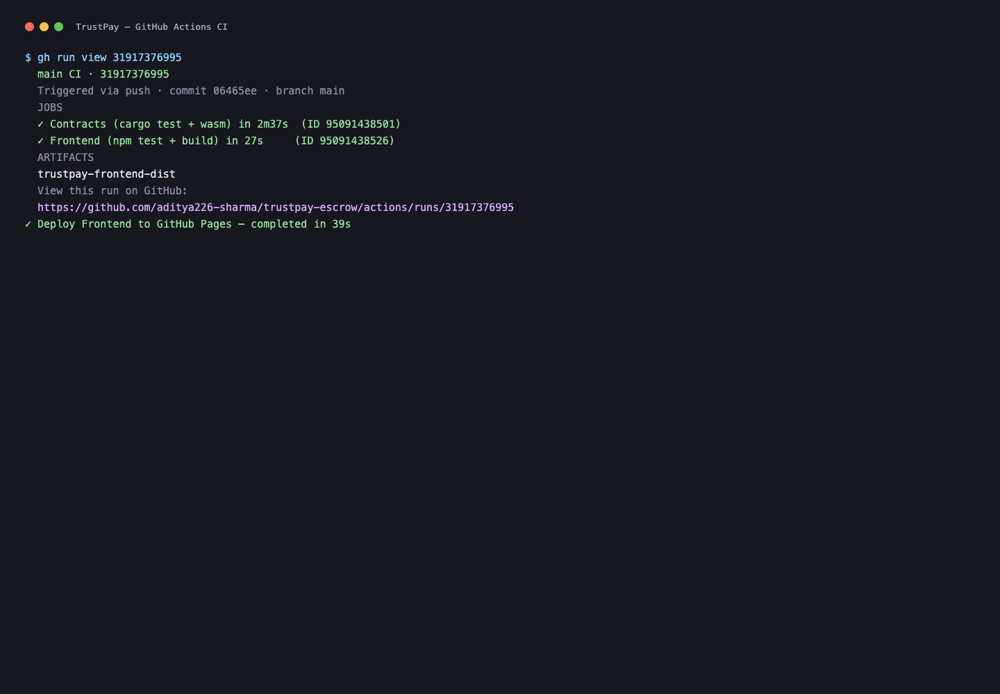
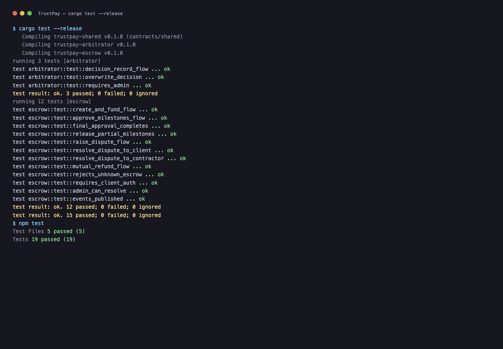

# TrustPay — Milestone Escrow Payments on Stellar

TrustPay is a production-grade escrow dApp for milestone-based remote work
payments. A client funds a smart contract, and funds are only released to the
contractor as milestones are approved — with disputes resolved by a neutral
on-chain arbitrator.

Built for the **Rise In Stellar Journey to Mastery — Level 3 (Orange Belt)**
challenge: moving beyond beginner demos toward real-world production software.

## Live demo

Deployed to GitHub Pages (testnet): **https://aditya226-sharma.github.io/trustpay-escrow/**

Install the [Freighter](https://freighter.app) browser extension, connect your
testnet wallet (fund it with the [friendbot](https://friendbot.stellar.org)),
then create, fund and approve an escrow. Live Soroban events stream into the UI
as each transaction confirms.

Demo video: see the [release assets](https://github.com/aditya226-sharma/trustpay-escrow/releases).

## What it does

- **Create an escrow** — client locks a token amount split into N milestones.
- **Fund** — the client pays the full amount into the contract; funds are held
  on-chain and are *not* spendable by anyone until milestones are approved.
- **Approve milestone** — the client releases each milestone to the contractor.
  The final approval completes the escrow.
- **Raise dispute** — either party can freeze the escrow; the decision is
  delegated to a separate arbitrator contract (inter-contract call).
- **Resolve dispute** — the admin releases funds to the client or contractor
  based on the arbitrator's recorded decision.
- **Mutual refund** — both parties agree to refund the remaining balance.
- **Live events** — every transition (`Created`, `Funded`, `Released`,
  `Disputed`, `Resolved`, `Refunded`) publishes a Soroban event that the
  frontend streams in real time.

## Architecture

```
┌─────────────────────────────────────────────────────────┐
│                        Frontend                          │
│   React + Vite + TypeScript · Freighter wallet ·        │
│   @stellar/stellar-sdk (rpc.Server, assembleTransaction) │
└───────────────────────┬─────────────────────────────────┘
                        │  Soroban RPC (soroban-testnet.stellar.org)
┌───────────────────────▼─────────────────────────────────┐
│                    Escrow contract                        │
│   trustpay-escrow · requires client auth to approve       │
│   holds funds · publishes lifecycle events                │
└───────┬───────────────────────────────┬─────────────────┘
        │  token transfers (SAC)        │  get_decision (inter-contract)
┌───────▼──────────────┐        ┌───────▼───────────────────┐
│  Stellar Asset        │        │   Arbitrator contract      │
│  Contract (TRST)      │        │   trustpay-arbitrator      │
└──────────────────────┘        │   stores dispute decisions │
                                └─────────────────────────────┘
```

The contract workspace is split into three crates:

| Crate | Purpose |
| --- | --- |
| `contracts/shared` (`trustpay-shared`) | Shared types (`Decision`, `DecisionRecord`) used by both contracts |
| `contracts/arbitrator` (`trustpay-arbitrator`) | Neutral dispute referee; records decisions |
| `contracts/escrow` (`trustpay-escrow`) | The escrow engine; talks to the SAC token and the arbitrator via a generated `#[contractclient]` interface |

The escrow contract only depends on the arbitrator through a generated client
trait, keeping the two contracts fully decoupled at build time (the arbitrator
is a dev-dependency only, so it is not embedded in the escrow WASM).

## Deployed contracts (testnet)

| Contract | Address |
| --- | --- |
| Escrow | `CCN4BHFSAAIOU4WC2PYBSFZ5WQLID7CJ7OXO44KYOAYGTTMVCXXMB5SQ` |
| Arbitrator | `CDGMGUM3ZPUE5IXHYQZBQAECA5JTNGJMNTEKZB2BQFPBKAFSSEJNH7NW` |
| Demo token (TRST) | `CDBM4XZH7KIEYJVXI73F32J4NJC4QA4XZQTD66WTMCQPSTMDYQF3WHVK` |

Admin / issuer: `GBTSHC3K2OZZFVAXUXZRSOOLW62FOE675WEDFIEH5GSI2CFD4H32MGJC`

### Sample transaction hashes

| Interaction | Transaction hash |
| --- | --- |
| Escrow contract upload (install) | `b7d8ad516d0879670b3adb45bcc95eb2ef0a4bb926ecfff6b4ec41d147f3072a` |
| Escrow `initialize` | `9edbc40fde920ad7e5800f2d6949489d96bc3acb21857fa7d75c85a565c58fa3` |
| TRST deploy (Stellar Asset Contract) | `d59b97981b72009260a29c3e5d05a68c79cff8915fdcb54b0f37908c2a8d857d` |
| `create` escrow | `a3d85678ea0fcb0bfc7698c3af7a2957db9096b501a9e3af3bcd8620828ba635` |
| `fund` escrow | `25e2903e044d50e116fa68db3035978ad0571954f37ea7c4e2d8d1af0556f71d` |
| `approve_milestone` (live app flow) | `288ec937ebc2371ec7876bc2f914f489368ef7c5ffd6f32bedb34a4f49d9281f` |
| Trustline (client → TRST) | `0f519151ff9f2539613e010ee777d73a61d0d79ef76af10201fb4d05d3cd728d` |
| Trustline (contractor → TRST) | `9cd57c70740d539f8505e167d4bc280588e253e8dcf22528cfdfb396fc476c90` |

## Screenshots

### Mobile responsive UI



### CI/CD running



### Test output (3+ passing tests)



## Getting started

### Prerequisites

- Rust stable + the `wasm32v1-none` target
- Node.js 20+
- `stellar` CLI 27.x (Soroban)

### Contracts

```bash
cargo test --release            # 15 unit tests (escrow + arbitrator)
cargo build --release --target wasm32v1-none   # WebAssembly artifacts
```

### Frontend

```bash
cd frontend
npm install
npm test        # vitest unit tests
npm run dev     # local dev server
npm run build   # production bundle
```

Configuration lives in `frontend/src/config.ts` and can be overridden with
environment variables (`VITE_ESCROW_CONTRACT`, `VITE_ARBITRATOR_CONTRACT`,
`VITE_TOKEN_CONTRACT`, `VITE_TOKEN_SYMBOL`, …). See `.env.example`.

### Deploying to testnet

```bash
# Upload + deploy each contract, then initialize it with your admin address
stellar contract install  --network testnet --source deployer --wasm target/wasm32v1-none/release/trustpay_escrow.wasm
stellar contract deploy   --network testnet --source deployer --wasm-hash <HASH>
stellar contract invoke   --network testnet --source deployer --id <ESCROW> -- initialize --admin <ADMIN>

# Interact (source = the calling account)
stellar contract invoke --network testnet --source client --id <ESCROW> -- create \
  --client <CLIENT> --contractor <CONTRACTOR> --arbitrator <ARBITRATOR> \
  --token <TOKEN> --amount 10000000000 --milestone_count 3
stellar contract invoke --network testnet --source client --id <ESCROW> -- fund --escrow_id 1
stellar contract invoke --network testnet --source client --id <ESCROW> -- approve_milestone --escrow_id 1
```

## CI/CD

GitHub Actions runs on every push to `main`:

- **Contracts** — `cargo test` (15 tests) plus a `wasm32v1-none` build that
  asserts both WASM artifacts are produced.
- **Frontend** — `npm ci`, `npm test` (vitest), `npm run build`.
- **Pages** — deploys `frontend/dist` to GitHub Pages.

Workflows: [`.github/workflows/ci.yml`](.github/workflows/ci.yml) and
[`.github/workflows/pages.yml`](.github/workflows/pages.yml).

## Tech stack

- **Contracts**: Rust, `soroban-sdk` 27, Stellar Asset Contract (SAC), WASM
  (`wasm32v1-none`)
- **Frontend**: React 18, Vite, TypeScript, `@stellar/stellar-sdk` 13,
  `@stellar/freighter-api`
- **CI/CD**: GitHub Actions; **Hosting**: GitHub Pages
- **Network**: Stellar testnet

## Level 3 checklist

- ✅ Public GitHub repository
- ✅ README with complete documentation
- ✅ 10+ meaningful commits
- ✅ Live demo link (GitHub Pages)
- ✅ Contract deployment addresses (testnet)
- ✅ Transaction hashes for contract interaction
- ✅ Screenshots: mobile-responsive UI, CI/CD, 3+ passing tests
- ✅ Demo video (release asset)

## License

MIT
